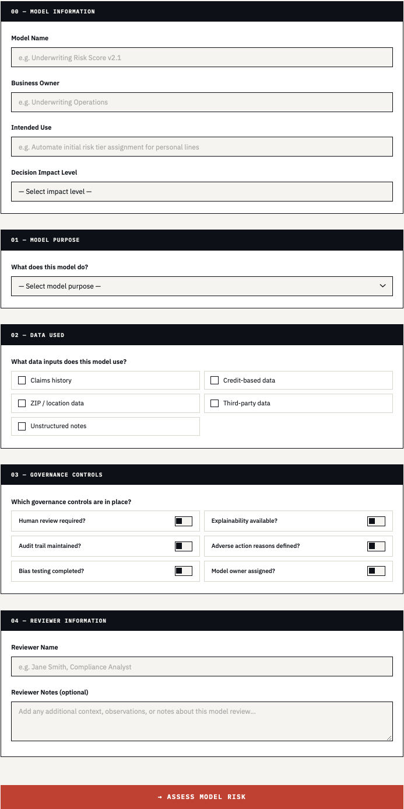
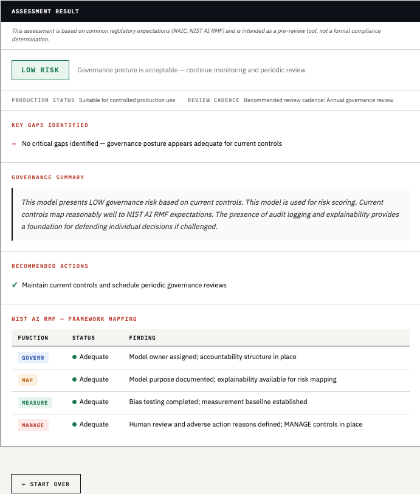
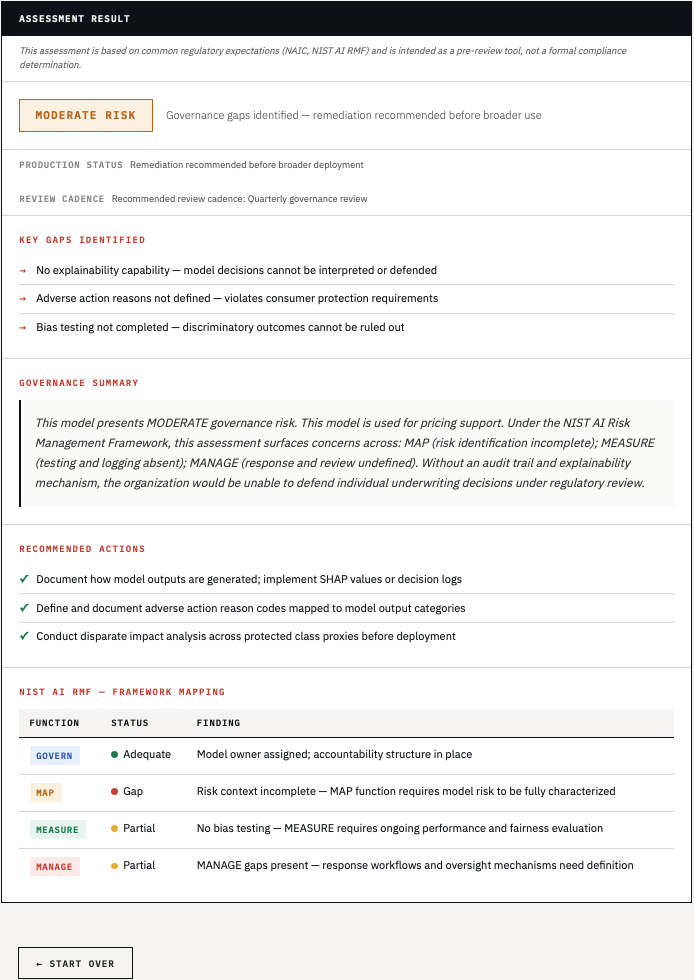
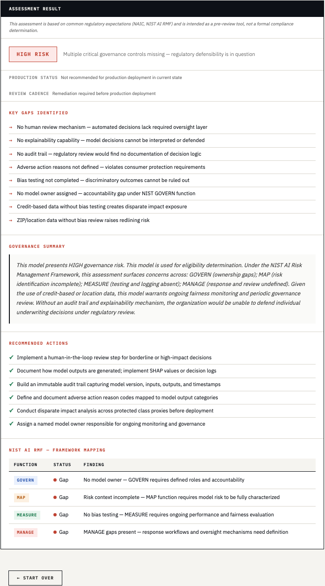
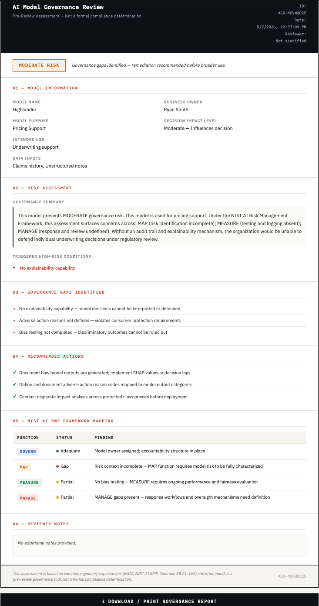

# AI Model Governance Reviewer

A browser-based governance intake and pre-review workflow for AI models used in insurance underwriting decisions.

Demonstrates practical AI governance workflow design aligned to NIST AI RMF concepts, insurance compliance review, underwriting risk analysis, and operational AI oversight.

**[→ Live Demo](https://ai-governance-reviewer.vercel.app)**  
**[→ GitHub Repository](https://github.com/ryanrvb-netizen/ai-governance-reviewer)**

---

## Why This Matters

As AI systems become increasingly embedded in insurance underwriting and operational decision-making, organizations must demonstrate explainability, accountability, auditability, and governance oversight before deployment.

Most organizations have governance frameworks on paper but no simple way to apply them in day-to-day review workflows. Compliance and governance teams — who are often non-technical — have no standardized intake process for evaluating whether a model meets basic regulatory expectations before it influences policyholder decisions.

This project demonstrates how governance frameworks can be translated into operational review tooling aligned to emerging AI risk management expectations.

---

## Problem Statement

Insurance companies are increasingly using AI and predictive models in underwriting workflows. These systems need to be explainable, reviewable, and auditable before they influence policyholder decisions.

Most organizations have governance frameworks on paper but no simple way to apply them in day-to-day review workflows. This tool addresses that gap by providing a structured, non-technical intake and pre-review workflow that surfaces risk early and standardizes governance documentation before escalation into deeper review processes.

---

## Overview

Core workflow: **Inputs → Assessment → Governance Artifact → Export/Print**

A compliance or governance user inputs information about an AI model and its controls. The tool produces a structured risk assessment and a downloadable governance artifact that can be shared internally or attached to a formal review process. No login, no backend, no external dependencies.

---

## Screenshots

### Intake Workflow

### LOW Risk Assessment

### MODERATE Risk Assessment

### HIGH Risk Assessment

### Governance Artifact / PDF Export

---

## Features

- **Governance intake form** — captures model name, business owner, intended use, decision impact level, model purpose, data inputs, and six governance controls
- **Rule-based risk classification** — LOW / MODERATE / HIGH based on governance control combinations and regulatory exposure
- **Plain-English governance summary** — references NIST AI RMF functions by name
- **Triggered high-risk condition flags** — surfaces foundational failures explicitly
- **Gap identification** — lists specific missing controls with regulatory context
- **Dynamic remediation recommendations** — action-oriented, tied to identified gaps
- **Production readiness status** — clear deployment guidance per risk level
- **Review cadence recommendation** — annual, quarterly, or remediation-required
- **NIST AI RMF framework mapping table** — GOVERN / MAP / MEASURE / MANAGE with status and findings
- **Downloadable governance artifact** — structured PDF-ready report via browser print
- **Reviewer name and notes** — supports real workflow documentation
- **Full form reset** — clean slate between assessments
- **No login, no backend, no external dependencies** — runs entirely in the browser

---

## Risk Classification Structure

### HIGH Risk
Triggers when foundational governance failures or severe regulatory exposure is present:
- No human review + high/critical decision impact
- No audit trail AND no explainability
- Sensitive or proxy data (credit, ZIP/location) used without bias testing
- High/critical impact with multiple missing controls
- No model owner AND no human review process

**Production status:** Not recommended for production deployment in current state  
**Review cadence:** Remediation required before production deployment

### MODERATE Risk
Triggers when meaningful governance gaps exist but remediation is achievable:
- Missing explainability capability
- Incomplete bias testing
- Adverse action documentation absent
- No model owner assigned
- Partial control coverage across governance functions

**Production status:** Remediation recommended before broader deployment  
**Review cadence:** Quarterly governance review

### LOW Risk
Requires governance controls substantially present with no major unmitigated exposures:
- Core controls in place
- No unmitigated sensitive data exposure
- Clear accountability and review structure

**Production status:** Suitable for controlled production use  
**Review cadence:** Annual governance review

---

## Governance Logic

The assessment evaluates six governance controls:

| Control | Why It Matters |
|---|---|
| Human review | Required for regulatory defensibility on adverse decisions |
| Explainability | Needed to interpret and defend model outputs |
| Audit trail | Required for regulatory review and accountability |
| Adverse action reasons | Consumer protection requirement |
| Bias testing | Mitigates discriminatory outcome risk |
| Model owner | Accountability structure under NIST GOVERN function |

Data inputs flagged for additional scrutiny: credit-based data, ZIP/location data (proxy discrimination risk under Colorado SB 21-169 and NAIC guidance).

---

## NIST AI RMF Alignment

Each assessment maps findings to the four NIST AI Risk Management Framework functions:

| Function | Governance Focus |
|---|---|
| GOVERN | Model ownership, accountability structure, policy alignment |
| MAP | Risk characterization, intended use clarity, data risk identification |
| MEASURE | Bias testing, performance evaluation, audit logging |
| MANAGE | Human review, adverse action documentation, response workflows |

---

## Governance Artifact

After each assessment, the tool generates a structured governance artifact containing:

- Assessment ID and timestamp
- Reviewer name
- Model information (name, owner, purpose, intended use, impact level, data inputs)
- Risk rating with reasoning
- Triggered high-risk conditions
- Governance gaps identified
- Recommended actions
- NIST AI RMF mapping table
- Reviewer notes
- Disclaimer footer

The artifact is exportable to PDF via browser print — no libraries or backend required.

---

## Key Skills Demonstrated

- AI governance workflow design
- Risk classification logic
- Regulatory framework translation (NIST AI RMF, NAIC, Colorado SB 21-169)
- Product thinking for non-technical compliance users
- Browser-native workflow development
- Operational documentation design
- NIST AI RMF function alignment
- Underwriting domain analysis

---

## What This Demonstrates

- Ability to translate regulatory frameworks into operational workflow logic
- Governance thinking applied to real insurance AI use cases
- Product design for non-technical compliance users
- Rule-based risk classification grounded in underwriting domain knowledge
- Structured artifact design suitable for internal review and audit processes
- Browser-native delivery with no infrastructure dependencies

---

## Tech Stack

- HTML
- CSS
- JavaScript
- Deployed on Vercel

---

## Future Enhancements

- Governance artifact export with custom branding
- Expanded assessment logic for additional insurance AI use cases (claims, fraud, pricing)
- Additional governance workflow templates

---

## Frameworks Referenced

- NIST AI Risk Management Framework (AI RMF 1.0)
- NAIC Model Bulletin on the Use of Artificial Intelligence Systems
- Colorado SB 21-169 (External Consumer Data and Information Sources)

---

## Status

Phase 1 complete. Live and deployed.
